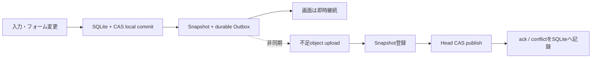

# FUMINIWA Snapshot Sync 設計

> **状態**: D-077で採択した次世代の保存・同期契約。RustサーバーMVPと並行して実装する。現行Appの保存先はまだ`.novelpkg`であり、本書を追加しただけでSQLite移行済み・出荷可能とは扱わない。
>
> **対象**: macOS 14以降、iOS / iPadOS 17以降、将来のWindows。通常利用はlocal-first、同期とオンライン履歴は同じ不変Snapshotを扱う。

## 1. 製品契約

利用者が意識するのは作品だけであり、同期処理ではない。次を常に成立させる。

1. 起動と作品を開く操作は、端末内に作品があればnetworkを待たない。
2. offlineでも、本文・構造・人物・プロット・伏線・世界観・資料を編集して自動保存できる。
3. 自動保存、話／画面遷移、background、window close、quitでは、端末内commitとdurable outbox登録までを完了条件にする。remote完了は待たない。
4. 同期は通信復帰後に自動再開する。手動同期は診断・即時再試行用であり、正しさの前提にしない。
5. 同じ作品が複数端末で分岐したら、時計や到着順で勝者を決めず、「この端末」「クラウド」「両方を別作品」の3択を必ず保持する。
6. local／onlineの履歴は、復元可能な作品全体Snapshotとして扱う。復元前の現在状態も先にSnapshot化する。
7. active editorへremote内容を直接注入しない。IME、Undo、sessionを守れる安全な境界だけでmaterializeする。

新しい端末にまだ作品がない初回downloadだけはnetworkを必要とする。既にlocal copyがある通常起動、編集、保存、終了では待たない。

## 2. 三つの境界

### 2.1 SQLiteは端末内の正本

通常Appは1 local profileにつき1 SQLite databaseを持つ。作品棚、現在の作品内容、Snapshot、Outbox、Inbox、Conflict、migration ledgerを同じtransaction境界へ置く。

- `PRAGMA foreign_keys = ON`
- WALを使い、保存transactionは`BEGIN IMMEDIATE`で直列化する
- 原稿commitは`PRAGMA synchronous = FULL`相当のdurabilityを要求する
- DBのURL、row ID、account token、端末名はportable dataへ含めない
- UIはSQLiteのlocal projectionだけを読む。catalog fetchを画面表示の前提にしない

SQLite自体を端末間でコピー／同期しない。schema migrationはlocal storageの実装詳細であり、同期protocolの互換契約ではない。

### 2.2 Content-addressed storeはbyte payloadの正本

本文、メモ、canonical entity payload、attachmentはSHA-256とbyte countで識別する。小さい値をSQLiteへinline保存してもよいが、Snapshot manifest上のidentityは同じhashにする。大きな資料はDB外のapp-private CASへ置く。

```text
Application Support/FUMINIWA/
├── Library-v3.sqlite
├── Library-v3.sqlite-wal
├── Objects-v1/
│   └── sha256/ab/cd/<64-hex-digest>
└── MigrationArchive-v1/          # 旧原稿のread-only保全。自動削除しない
```

- objectの採用前にhashとbyte countをread-backする
- final pathへのrename後にだけDBから参照する
- DB transactionに失敗した未参照objectは、grace period後のmark-and-sweep対象にする
- local saveとremote uploadは別であり、quota／通信障害でlocal saveを止めない
- attachmentもonline Snapshotの対象にする。未upload objectがあるSnapshotはremote headにできない

`.novelpkg`から見つかった未知の非hidden resourceはImport時にCASへ保全し、同じ端末からのExportへ戻せるようにする。ただし意味と安全性を解釈できないresourceは同期対象にせず、UIで「この端末だけ」と示す。

### 2.3 `.novelpkg`はImport／Export専用

`.novelpkg` v1〜v3はmacOS／iOS／Windows間のportable互換形式として維持するが、通常編集の正本、autosave先、同期working copyにはしない。

- Import: Package Validatorで検証し、new WorkIDを予約してSQLite＋CASへtransactionalに取り込む。外部原本を変更しない
- Export: 1つのcommitted Snapshotから新しいpackageを生成し、read-back検証後にdestinationへatomic採用する
- Export中に現在作品、WorkID、session、同期bindingを変更しない
- package内の`documentID`はportable document identityであり、同期の`WorkID`とは別とする
- packageの`attachments/`、既知metadata、保全対象の未知resourceを可能な範囲でround-tripする
- local SQLite schema、Outbox、Conflict、account、server URLをpackageへ書かない

## 3. Local schemaの最小責務

実カラム名は実装PRでfixtureとともに固定する。責務は次から増やさない。

| table | 役割 |
| --- | --- |
| `works` | WorkID、portable document ID、現在local Snapshot、最後に確認したremote head、account／tenant fence、trash状態 |
| `chapters` / `episodes` | stable ID、親ID、配列順、現在payload hash |
| `characters` / `plot_cards` / `flags` / `world_notes` | stable ID、配列順、現在payload hash |
| `resources` | hash、byte count、media type、local availability、upload状態 |
| `work_resources` | 作品とattachment／opaque resourceの論理path対応 |
| `snapshots` | immutable Snapshot ID、WorkID、manifest hash、理由、表示用capture時刻、retention class |
| `snapshot_parents` | 0〜2個のparent Snapshot。競合解決だけ2 parentを許可 |
| `outbox` | operation ID、expected remote head、candidate Snapshot、retry状態 |
| `remote_inbox` | cursorと検証済みremote Snapshot。active editorへ未反映の状態を保持 |
| `conflicts` | base／local／remote Snapshot、観測remote generation、未解決／解決済み状態 |
| `operation_receipts` | client側で確認したidempotent operation結果 |
| `migration_ledger` | 旧sourceごとのdiscovered→copied→verified→committed checkpoint |

作品保存は次を1 SQLite transactionで行う。

1. native editorのIMEを必要な境界で確定し、`NovelDocument`の値Snapshotを取る。
2. 変更entityのcanonical bytesを作り、CASへ不足objectを封印する。
3. current entity pointerと順序を更新する。
4. sorted manifestからimmutable Snapshot IDを決める。
5. `works.current_local_snapshot_id`を更新する。
6. 同期対象作品なら同じtransactionでOutbox operationを追加／coalesceする。
7. commit後にbackground workerを起こす。

crashがCAS封印とDB commitの間に起きても旧current Snapshotは変わらない。DB commit後・worker起動前に落ちてもOutboxは残り、次回起動で再開する。

## 4. Snapshot wire v1

### 4.1 識別子

- `WorkID`: UUID。棚と同期の作品identity
- `SnapshotID`: canonical Snapshot envelope bytesのSHA-256
- `ObjectID`: payload bytesのSHA-256
- `OperationID`: clientが一度生成してretry中は変えないUUID
- `Head`: `{ generation: UInt64, snapshotID: SnapshotID }`

文字列hashの前処理にUnicode normalizationや改行変換を入れない。wire JSONはcanonical encoding規則をfixtureで固定する。native editorのUTF-16 range、path、timestampをwinner判断へ使わない。

### 4.2 Manifest

Snapshotは作品全体の論理状態を表す。転送時は変わったobjectだけを送る。

```json
{
  "version": 1,
  "workID": "UUID",
  "parents": ["sha256"],
  "document": {
    "documentID": "UUID",
    "title": { "hash": "sha256", "bytes": 12 },
    "synopsis": { "hash": "sha256", "bytes": 42 },
    "chapterOrder": ["UUID"]
  },
  "entities": [
    { "kind": "episode", "id": "UUID", "parentID": "UUID", "hash": "sha256", "bytes": 1200 }
  ],
  "resources": [
    { "logicalID": "UUID", "name": "map.png", "hash": "sha256", "bytes": 42000, "mediaType": "image/png" }
  ],
  "reason": "autosave"
}
```

`capturedAt`は一覧表示のhintとしてSnapshot envelope外に保存してよいが、Snapshot ID、head CAS、競合winnerには使わない。`reason`は`autosave`、`transition`、`background`、`manual`、`restore`、`conflictResolution`、`migration`に限定する。

### 4.3 Server API

Rust APIは認証済みtenant内で次を提供する。具体的なpathとJSONはserverのOpenAPI／integration testを正にする。

1. 不足objectの照会とupload
2. immutable Snapshot manifestの登録
3. `publish(operationID, workID, expectedHead, candidateSnapshotID)`
4. current head／作品棚／cursor以後の変更取得
5.未解決Conflictの取得と解決結果publish
6. retained Snapshot一覧とmanifest取得

`publish`はPostgreSQL transactionで次をatomicに行う。

- operation receiptが既にあれば同じ結果を返す
- candidate manifestと全objectの存在／hash／tenant ownershipを検査する
- current headが`expectedHead`と一致すればgenerationを1増やす
- 一致しなければcandidateを消さず、base／local／remoteを持つConflictとして保存する
- resultとoperation receiptを同じtransactionでcommitする

push／WebSocketは変更hintにすぎない。正しさはcursor付きpullとidempotent retryで成立させる。

## 5. Background workerとUI lifecycle

local commitとremote I/Oを同じactor／document gateへ入れない。



- autosaveは1〜2秒debounceでlocal commitする
- 話／画面遷移、background、resign、window close、quitではdebounceをflushする
- close／quit成功条件はIME確定、SQLite commit、Outbox durabilityまで。network upload完了ではない
- OS background timeが得られればworkerを続け、打ち切られても次回起動／foreground／network復帰で再開する
- 同一WorkIDの未送信Snapshotは、保持対象を壊さない範囲で最新candidateへcoalesceできる
- manual「今すぐ同期」は同じworkerを起こすだけで、別の保存／競合protocolを持たない
- quota超過、server停止、認証失効でもlocal編集と履歴を止めない。「この端末に保存済み／送信待ち」と分けて表示する

remote fast-forwardはstagingへ取得し、未保存local変更がなく、IME変換中でなく、session／surface generationが一致する安全な遷移時だけcurrent local Snapshotへ進める。それ以外はInboxに保持する。

## 6. Conflictの3択

CAS不一致は同期失敗ではなく、両方の保存に成功した競合状態である。base、local candidate、現在remoteを不変Snapshotとしてserverとlocalの両方に残す。暗黙winner、自動merge、timestamp LWWを行わない。

### この端末の内容を使う

現在remote headとlocal candidateをparentに持つdecision Snapshotを作り、表示時に確認したremote headをexpected headとしてCASする。確認後にheadが進んでいたら古い選択を適用せず再提示する。

### クラウドの内容を使う

現在localを履歴／競合candidateとして保持したまま、remote Snapshotを安全なeditor境界でmaterializeする。local candidateを削除しない。

### 両方を別作品として残す

元WorkIDはremoteをmaterializeし、local candidateから新しいWorkIDのroot Snapshotを作る。portable document IDやtitleでdeduplicateしない。

解決済みにするのは、選択結果のlocal commit、remote publish、read-backがすべて確認できた後だけとする。途中で落ちた場合は同じoperation IDから再開する。

## 7. 履歴・復元・削除

自動SnapshotはD-074のTime Machine型保持を引き継ぐ。

- 直近1時間: 全件
- 24時間以内: 1時間に1件
- 30日以内: 1日に1件
- 1年以内: 1週間に1件
- それ以前: 1か月に1件

手動、未upload、Outbox参照中、未解決Conflict、migration、復元前、利用者pinは自動削除しない。解決済みConflictのcandidateも最低90日保持する。作品削除は30日trashを既定にし、即時hard deleteを通常UIへ出さない。

復元は過去Snapshotをそのままcurrent rowへ巻き戻す操作ではない。

1. 現在状態を`restore-preflight`相当の手動Snapshotとして保存する。
2. 選んだ過去manifestを検証する。
3. その内容を持つ新Snapshotを、現在headと過去Snapshotをparentにして作る。
4. local currentを新Snapshotへ進め、通常Outboxからpublishする。

server GCはPostgreSQL参照を正とするmark-and-sweepで行う。current head、retained Snapshot、未解決Conflict、operation receipt、trash grace中をrootにし、7日以上のgraceを置く。PostgreSQL PITRとobject storage versioning／backupは、利用者向けSnapshotとは別の運用復旧層である。

## 8. 認証・暗号・tenant fence

- 全APIはTLS必須。LAN検証版の固定Bearer tokenはproduction非対応である
- serverは認証subjectをtenant／ownerへ写像し、request bodyのowner IDを信用しない
- WorkID、SnapshotID、ObjectIDはtenant内でのみ参照できる
- 別account／tenantへOutboxを送らない。account scope変更時は旧scopeをquarantineする
- operation、conflict、audit logに原稿本文、title、local pathを出さない
- object downloadは短寿命の署名URLまたはAPI proxyを使う
- upload size、manifest entries、Snapshot depth、request rateへ上限を設ける

E2EEを採択する場合もSnapshot／CAS／head CASのprotocolは変えず、clientがpayloadを暗号化してからhashする。鍵回復、複数端末追加、search／preview、dedup範囲が変わるため、production client実装前に別Decisionで固定する。

## 9. 旧保存／CloudKitからの非破壊移行

移行はdual-read／single-writeとし、旧CloudKitと新serverを同時authorityにしない。

1. Package Validatorで全app-private `.novelpkg`、registry、dirty set、Note Conflict、legacy Work review、snapshot、attachmentをwork単位にinventory／attestする。
2. raw bytesと検証済みpackageを`MigrationArchive-v1`へread-onlyで保存する。旧fileをin-place更新、reset、削除しない。
3. 新SQLite／CASへWork単位でcopyし、`discovered → copied → verified → committed`をmigration ledgerへ記録する。各段階でkill／retry可能にする。
4. current local、未送信local、remote、legacy conflictの各候補を別Snapshotとして保存する。自動winnerやreview clearをしない。
5. 新serverは新namespaceを使う。旧CloudKitは移行中read-onlyとし、新clientからwriteしない。
6. initial Snapshot upload後にmanifestと全objectをread-back検証してからserver bindingをcommitする。
7. minimum client version fenceで全端末を新protocolへ揃える。mixed clientを同一namespaceで許可しない。
8. 旧package、journal、CloudKit recordは少なくとも1 releaseとrollback／Export確認が終わるまで自動削除しない。

旧Note stateのadditive field欠落、旧Work review、account mismatch、corrupt／unknown schemaはgolden fixtureにする。1作品の異常で作品棚全体を空にしない。

## 10. 実装順とRelease Gate

### S0: protocolとserver MVP

- 本書、D-077、canonical fixture
- Rust API、PostgreSQL migration、S3-compatible object store、Docker Compose
- operation retry、head CAS、同時publish、object欠損拒否、tenant分離のintegration test

### S1: local SQLite foundation

- SQLite schema／migration actor／CAS
- `.novelpkg` Import／Export codec化
- local autosave、作品棚、Snapshot、restore
- network永久停止、disk full、process killのfocused test

### S2: client sync worker

- Outbox upload／retry、cursor pull、account fence、background scheduling
- active editor非注入、remote fast-forward staging
- MacとiPhoneの同一account往復

### S3: Conflict／online history

- 3択の再起動復元とstale head再確認
- online retained Snapshot一覧／restore／quota表示
- attachment upload／download／壊れたobject拒否

### S4: migrationとproduction hardening

- 全旧schema fixture、全checkpoint kill／retry、2回実行の冪等性
- Production認証、TLS、backup／restore、監視、rate／resource limit
- minimum client fence、旧CloudKit read-only cutover、rollback drill
- signed Mac＋iPhone、実offline、account switch、process kill、VoiceOver、Dynamic Type

次が1つでも未完了ならRelease NO-GOとする。

- networkを永久停止しても即open／edit／autosave／transition／quitできる
- quit成功時にSQLite current SnapshotとOutboxが再起動後も一致する
- lost ack、duplicate request、順不同responseで原稿／headを失わない
- 同時offline編集の3択すべてが再起動後にも出て、選ばれなかった内容を復元できる
- remote headは全object存在確認後だけ進む
- 別accountの作品、Outbox、objectを混ぜない
- migration前後の原文bytesとExport結果を照合できる
- server backupからDBとobjectを整合した時点へ復旧できる

## 11. Product decisionが必要な点

設計とLAN検証は次を仮置きして進められるが、production client着手前に利用者の判断が必要である。

1. **認証**: 独自メール／passkey、Sign in with Apple、または組合せ。推奨はSign in with Apple＋passkey recoveryで、serverのuser identityはApple固有IDを直接WorkIDへ埋め込まない。
2. **E2EE**: 初版必須か、TLS＋server-side encryptionで先行するか。推奨はprotocolをE2EE-readyに保ち、鍵回復UXを設計できるまではproductionに出さないか、初版範囲を明示して段階導入する。
3. **到達範囲**: `192.168.11.5`をLAN／VPN限定の検証機にするか、Internet公開productionにするか。推奨は検証専用。外部公開はreverse proxy、公開domain、証明書、更新、監視、off-site backupを別構成にする。
4. **容量と保持**: attachmentを含むonline履歴のquota、trash、Conflict保持。推奨初期値は作品合計5 GiB、attachment単体250 MiB、trash 30日、解決済みConflict 90日で、quota超過でもlocal保存は継続する。
