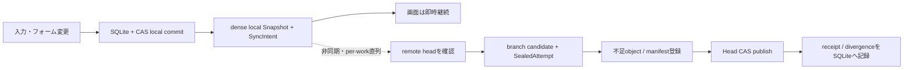

# FUMINIWA Snapshot Sync 設計

> **状態**: D-077で採択した次世代の保存・同期契約。現時点は設計のみで、Rust server、SQLite client、migrationは未実装。現行Appの保存先はまだ`.novelpkg`であり、本書を追加しただけでSQLite移行済み・出荷可能とは扱わない。
>
> **対象**: macOS 14以降、iOS / iPadOS 17以降、将来のWindows。通常利用はlocal-first、同期とオンライン履歴は同じ不変Snapshotを扱う。

## 1. 製品契約

利用者が意識するのは作品だけであり、同期処理ではない。次を常に成立させる。

1. 起動と作品を開く操作は、端末内に作品があればnetworkを待たない。
2. offlineでも、本文・構造・人物・プロット・伏線・世界観・資料を編集して自動保存できる。
3. 自動保存、話／画面遷移、background、window close、quitでは、端末内commitとdurable SyncIntent登録までを完了条件にする。remote完了は待たない。
4. 同期は通信復帰後に自動再開する。手動同期は診断・即時再試行用であり、正しさの前提にしない。
5. 同じ作品が複数端末で分岐したら、時計や到着順で勝者を決めず、「この端末」「クラウド」「両方を別作品」の3択を必ず保持する。
6. local／onlineの履歴は、復元可能な作品全体Snapshotとして扱う。復元前の現在状態も先にSnapshot化する。
7. active editorへremote内容を直接注入しない。IME、Undo、sessionを守れる安全な境界だけでmaterializeする。

新しい端末にまだ作品がない初回downloadだけはnetworkを必要とする。既にlocal copyがある通常起動、編集、保存、終了では待たない。

## 2. 三つの境界

### 2.1 SQLiteは端末内の正本

通常Appは1 local profileにつき1 SQLite databaseを持つ。作品棚、現在の作品内容、Snapshot、SyncIntent、SealedAttempt、Inbox、Conflict、migration ledgerを同じtransaction境界へ置く。

- `PRAGMA foreign_keys = ON`
- WALを使い、保存transactionは`BEGIN IMMEDIATE`で直列化する
- 原稿commitは`PRAGMA synchronous = FULL`相当のdurabilityを要求する
- DBのURL、row ID、account token、端末名はportable dataへ含めない
- UIはSQLiteのlocal projectionだけを読む。catalog fetchを画面表示の前提にしない

SQLite自体を端末間でコピー／同期しない。schema migrationはlocal storageの実装詳細であり、同期protocolの互換契約ではない。

### 2.2 Content-addressed storeはbyte payloadの正本

本文、メモ、canonical entity payload、attachmentはSHA-256とbyte countで識別する。小さい値をSQLiteへinline保存してもよいが、Snapshot manifest上のidentityは同じhashにする。大きな資料はDB外のapp-private CASへ置く。

```text
Application Support/FUMINIWA/
├── Library-v3.sqlite
├── Library-v3.sqlite-wal
├── Objects-v1/
│   └── sha256/ab/cd/<64-hex-digest>
└── MigrationArchive-v1/          # 旧原稿のread-only保全。自動削除しない
```

- objectの採用前にhashとbyte countをread-backする
- final pathへのrename後にだけDBから参照する
- DB transactionに失敗した未参照objectは、grace period後のmark-and-sweep対象にする。ただしmark時点だけで削除せず、後述のCAS mutation gate内でdelete直前に全rootを再検査する
- local saveとremote uploadは別であり、quota／通信障害でlocal saveを止めない
- attachmentもonline Snapshotの対象にする。未upload objectがあるSnapshotはremote headにできない

`.novelpkg`のvalidated tree全itemから、exactに消費したknown pathとattachment pathだけを引いた集合をlocal-only portable resource inventoryとする。これにより未知の非hidden root itemだけでなく、v1／v2の`chapters/`／`notes/`、v3の`episodes/`／`episode-notes/`／`world-notes/`内のorphan payload、empty directory、raw `snapshots/` subtreeもImport時に保全し、同じ端末からのExportへ戻せる。inventoryはrootからの相対path component列、kind（file／directory）、元の綴り、fileのObjectID／byte countを持つ。componentごとにpath traversalと既知namespace衝突を拒否し、Unicode 15.1.0 NFC→Default Full Case Folding（`C`／`F`、Turkic除外）→NFCのUTF-8 bytesをcollision keyとしてfile／directory衝突を検査する。R0では同版Unicode dataから生成したtableとsource hashをrepoへ固定し、OS／locale APIを使わない。original componentはUTF-8 255 bytes／UTF-16 240 code units以下、`/` joinしたrelative pathはUTF-8 768 bytes／UTF-16 512 code units以下、depth 16以下とし、separatorも数える。attestation／backup digest／Export read-backの列挙順は元componentのUTF-8 byte辞書順、prefixではdirectoryをdescendantより先とし、filesystem／locale順を使わない。symlink、junction／reparse point、special file、hard-link依存は受け入れない。後の編集で新しい既知payload pathとpreserved itemが衝突した場合も黙って上書きせず、Exportをfail-closedにして修復コピーを求める。意味と安全性を解釈できないresourceは同期対象にせず、UIで「この端末だけ」と示す。

### 2.3 `.novelpkg`はImport／Export専用

`.novelpkg` v1〜v3はmacOS／iOS／Windows間のportable互換形式として維持するが、通常編集の正本、autosave先、同期working copyにはしない。

- Import: Package Validatorで検証し、new WorkIDを予約してSQLite＋CASへtransactionalに取り込む。外部原本を変更しない
- Export: 1つのcommitted Snapshotから新しいpackageを生成し、read-back検証後にdestinationへatomic採用する
- Export中に現在作品、WorkID、session、同期bindingを変更しない
- package内の`documentID`はportable document identityであり、同期の`WorkID`とは別とする
- packageの`attachments/`、既知metadata、保全対象の未知resource、raw legacy `snapshots/` subtreeを契約どおりround-tripする。既知modelはlogical equality、`documentID`と`createdAt`は規定のidentity／instant、`updatedAt`だけはExport採用時の現在UTC、attachment／opaque file／raw legacy snapshot bytesとpath／kindはbyte-exactに照合する
- local SQLite schema、SyncIntent／SealedAttempt、Conflict、account、server URLをpackageへ書かない

## 3. Local schemaの最小責務

`local profile`はonline accountではなく、OS user／app installationが所有する1つの端末内作品棚を指す。accountを切り替えてもDBを作り直さず、各workを`unbound`／`bound(serverInstance, protocolEpoch, accountID)`／`quarantined`のいずれかへfenceする。

Apple clientのSQLite adapterにはGRDBを採用し、`DatabasePool`を`LocalLibraryStore` actorの内部へ閉じ込める。GRDBのAPIをNovelCoreやUIへ出さない。schema migration、WAL、transaction、observation、SQLite Online Backup APIへの境界を自前の薄いprotocolで包み、Swift／Windows間で共有するのはSQL fileではなく論理schemaとfixtureだけにする。実カラム名はR0/R1でfixtureとともに固定し、責務は次から増やさない。

| table | 役割 |
| --- | --- |
| `works` | WorkID、immutable `work_document_object_id` anchor、現在local Snapshot、単調増加local generation、stable checkpoint Snapshot＋そのlocal generation、remoteと内容一致を最後にread-backしたlocal Snapshot、最後に確認したremote head、account／tenant fence、端末内の表示／archive状態 |
| `chapters` / `episodes` | stable ID、親ID、配列順、現在payload hash |
| `characters` / `plot_cards` / `flags` / `world_notes` | stable ID、配列順、現在payload hash |
| `resources` | ObjectID、byte count、local availability、`available／quarantined／deleting` GC state、sweep generation／deletion token。CAS identityはbytesだけで、media type／remote状態を所有しない |
| `resource_remote_presence` | immutable server instance＋protocol epoch＋opaque account ID＋credential-bound account fence＋ObjectIDごとのverified remote presence。別scopeへ流用しない |
| `work_resources` | 作品とattachment／opaque resourceの論理path component、kind、元の綴り、ObjectID対応。active行はlocal GC root |
| `snapshots` | immutable Snapshot ID、WorkID、canonical manifest、retention／availability |
| `snapshot_occurrences` | 同じSnapshot IDに対するautosave／manual／lifecycle／online acknowledged等の端末内発生記録、capture時刻、pin。Snapshot identity外で複数可 |
| `snapshot_entries` | SnapshotごとのEntityKey、ObjectID、byte count、content type／entity schema context |
| `snapshot_parents` | 同一WorkID内の0〜2 parent。rootは0、通常は1、自動統合／競合解決／復元は2 |
| `sync_intents` | 最新local stateをonlineへ反映したいという未送信intent。送信前だけcoalesce可 |
| `checkpoint_replication_intents` | manual／lifecycle occurrenceをremote headを動かさずonlineへ複製する耐久intent。local Snapshot、capture時のremote base、reason、ensure-pinned、binding scopeを保持 |
| `snapshot_remote_equivalents` | binding scopeごとのlocal Snapshotと、同じentriesを持つ検証済みremote Snapshotの対応。parent差によりIDは異なり得る |
| `publish_attempts` | expected remote head、candidate Snapshot、source local generation／Snapshotとsealed publish command参照 |
| `sealed_remote_commands` | 全mutating remote commandのkind、binding scope、operation ID、canonical request bytes／digest、pending／receipt／read-back結果。local-origin head mutationはsource local generation／Snapshotも持ち、送信前にimmutable化 |
| `object_transfers` | SealedAttempt＋ObjectIDごとのcreate／finalize command参照、upload ID、complete PUT状態、expiry／retired session。再起動可能 |
| `remote_inbox` | cursorと検証済みremote Snapshot。active editorへ未反映の状態を保持 |
| `conflicts` | base／local／remote Snapshot、観測remote generation、未解決／解決済み状態 |
| `pending_conflict_resolutions` | 3択をsealした時点のsource local generation／Snapshot、選択、resolution Snapshot、sealed command参照。ACK時の条件付き採用に使う |
| `pending_keep_both` | 1 Conflictに予約したnew WorkID／root、元Work resolution、expected head、operation。cloneの通常laneをatomic resolve完了までblock |
| `operation_receipts` | client側で確認したidempotent operation結果。object retention rootにはしない |
| `migration_ledger` | 旧sourceごとのdiscovered→copied→verified→committed checkpoint |
| `backup_generations` | backup ID、staging DB世代、active CAS pin、inventory digest、commit marker。committed世代だけが復元候補で、commit後は独立backup object copyを正にする |

CAS fileのhash計算、fsync、同一volume内no-overwrite renameはSQLite transactionの前に完了する。Apple platformではSQLiteの`fullfsync`とCAS採用時の`F_FULLFSYNC`可否をR1実機fixtureで固定し、API非対応を成功扱いにしない。作品保存はその後の短い1 SQLite transactionで次を行う。

1. native editorのIMEを必要な境界で確定し、`NovelDocument`の値Snapshotを取る。
2. 変更entityのcanonical bytesを作り、CASへ不足objectを封印する。
3. current entity pointerと順序を更新する。
4. sorted manifestからimmutable local Snapshot IDを決める。実内容と親が同じautosaveはno-opにする。dense autosaveは直前のautosaveを毎回parentにせず、`works.stable_checkpoint_snapshot_id`を唯一のparentにしたleafとして作る。manual／lifecycle境界でcurrent leafと同じ内容をcheckpoint化するときは新しい子Snapshotを作らず、同じSnapshot IDへ保護されたoccurrenceを追加してstable checkpointへatomic promotionする。境界に未保存内容があれば、従来のstable checkpointをparentに新しいleafを作って同じtransactionでpromotionする。online ack時はattempt sourceへのacknowledged occurrenceを常に追加するが、stable checkpoint pointerは`source_local_generation >= stable_checkpoint_local_generation`をtransaction内で満たす場合だけsourceへ進める。古いlost-ACK replayで、後からmanual／lifecycle promotion済みのcheckpointを後退させない。最新leafをparentにcheckpointを作らないため、retention対象外leafが祖先化せず削除できる。
5. `works.current_local_snapshot_id`を更新する。
6. 同期対象作品なら同じtransactionで`SyncIntent(latestLocalSnapshotID)`を追加／更新する。manual／lifecycle occurrenceには別の`CheckpointReplicationIntent(localSnapshotID, observedRemoteBase, reason, ensurePinned)`も追加する。manualは既定`ensurePinned=true`、lifecycleは既定`false`とする。ここではoperation IDとexpected remote headをまだ決めない。
7. commit後にbackground workerを起こす。

crashがCAS封印とDB commitの間に起きても旧current Snapshotは変わらない。DB commit後・worker起動前に落ちてもIntentは残り、次回起動で再開する。disk full、DB error、CAS read-back失敗時は旧currentを保持し、画面遷移／close／quitを保存成功扱いにしない。

local CASのreference採用とphysical GCは専用`CASMutationGate`でObjectIDごとに直列化し、document operation gateやUI actorを保持しない。saveはstaging bytesを先に封印してからgateへ入り、fileのhash／size／存在とresource stateを再検査し、`quarantined`なら同じSQLite transactionで`available`へ戻してreferenceを作る。sweepは候補を`quarantined`へ置いたあと、1 objectずつgateへ入り、delete直前の短いtransactionでlocal currentを含む全hard root／referenceを再検査する。参照があれば削除をcancelし、なければ一意なdeletion tokenで`deleting`へ進めてcommitし、gateを保持した非suspending file operationでexact CAS pathだけをunlinkしてdirectoryをfsyncし、token一致を再検査してrowをfinalizeする。`deleting`が先なら新規referenceは削除完了を待ってstaging bytesを再adoptしてからcommitし、存在しないfileを参照しない。各object後にgateを解放してsaveを優先する。crash後はtoken、file存在、rootを照合し、root＋valid bytesならcancel、rootなしならresume、bytes欠損ならreferenceを作らずrecoveryへ送る。

physical backupはDBとCASを同じ復元可能世代へ閉じる。backup IDをdurable化してCAS sweepだけを止め、sourceへの保存は許したままSQLite Online Backupを専用staging DBへ完了する。`quick_check`後、live DBではなく完成したstaging DBから`library_generation`とreachable ObjectIDを導出する。sweep barrier中にその集合をsource DBへactive backup pinとしてcommitしてからbarrierを解放し、全objectを独立backup storeへcopy／hash／byte count read-backする。staging DB、sorted inventory digest、commit markerをfsyncした時点だけを復元候補とし、その後source pinを外す。並行saveでsourceが次世代へ進んでもbackupへ混ぜない。pin前crashのstagingは破棄し、pin後crashは同じbackup IDとpinから再開する。restoreはcommit marker、DB `quick_check`、inventory全objectのread-backが揃うまで採用せず、欠損時に空libraryへfallbackしない。

physical backupのlifecycleも製品契約にする。最初の原稿commit後は次のidle／background機会、以後は最後のverified backupから24時間超でforeground idleまたはbackgroundへ入った時に非同期開始し、通常save、画面遷移、closeを待たせない。SQLite schema migrationと新sync engine cutoverの直前はverified pre-migration世代を必須にし、作成不能なら旧DBを変えずmigrationを延期する。成功直後にもpost-migration世代を作る。独立backup storeは世代inventory＋content-addressed objectを持ち、世代間でbytesをdeduplicateする。直近3 verified世代と、post-migration世代の検証後30日が経つまでのpre-migration世代を削除しない。不足容量時もlocal commitを止めず、incomplete stagingとpolicy超過世代だけを安全に掃除して「端末バックアップ待ち」を表示する。最後の2 verified世代を新規backupのため暗黙削除しない。起動時corruptionでは新しい順にcommit marker、DB `quick_check`、全CAS inventoryを検証した世代だけを復旧候補にし、空DBを自動作成しない。

## 4. Snapshot wire v1

### 4.1 識別子

- `WorkID`: lowercase hyphenated UUID。棚と同期の作品identity
- `SnapshotID`: RFC 8785 JCSでcanonicalizeしたmanifest UTF-8 bytesのSHA-256
- `ObjectID`: canonical entity bytesまたはattachment raw bytesのSHA-256
- `OperationID`: workerがattemptをsealするとき一度だけ生成し、retry中は変えないlowercase UUID
- `Head`: `{ generation: 1...9007199254740991, snapshotID: SnapshotID }`。headなしは`null`で表し、generationはJSON安全整数の範囲に固定してwire上の`UInt64`を許さない

UUIDは128-bitの論理値として扱い、表記caseをidentityにしない。`.novelpkg` readerはハイフン付きUUIDを大小文字非依存でparseし、SQLite key、EntityKey、canonical entity payload、Snapshot wireへ入れる前にlowercaseへ変換する。packageの生UUID文字列をそのままhashしない。Export writerは同じ論理値を`.novelpkg` v3契約どおりuppercase JSON値／ID filenameへ変換する。したがってuppercase package → lowercase Snapshot → uppercase packageのround-tripで論理IDは一致し、ObjectIDはlowercase wire bytesだけから全platform同一に決まる。

wire JSONはI-JSON制限付きRFC 8785 JCSとする。UTF-8、Unicode scalar、escape、object key順、数値表現をJCSへ従わせ、浮動小数、duplicate key、unknown field、不正UTF-8、unpaired surrogateを拒否する。整数はJSONの安全整数範囲かつ各schemaの上限内、digestは64文字lowercase hexとする。意味上順不同のparentはSnapshotIDの辞書順、entryは`entityKey`のUTF-8 byte順へ並べる。`null`、省略、空配列をschemaごとに1表現へ固定する。

文字列をhashする前にUnicode normalizationや改行変換を追加しない。`byteCount`は実際にhashしたoctet数である。native editorのUTF-16 range、local path、Snapshot capture／update時刻、端末名はmanifestとwinner判断へ含めない。ただし`.novelpkg` round-tripで保持すべき作品固有の不変値`documentCreatedAt`は`work/document` payloadに含め、calendar-validなRFC 3339 UTC・秒精度・末尾`Z`へ固定する。JSON Schemaの`format`だけに依存せず、実在日、閏日、UTC表現をpure semantic validatorとfixtureで検査する。Import／新規作成時に一度決め、通常保存、同期、復元、Conflict解決で変えない。`.novelpkg`の`updatedAt`はSnapshot identityに入れず、Export採用時にwriterが現在UTCを生成する。R0でJSON Schema、OpenAPI、valid／invalid canonical fixtureを同じcommitへfreezeし、Swift／Rust／C#が同じcanonical bytesとhashを返すまで実装へ進まない。

### 4.2 Manifest

Snapshot manifestは作品全体の完全なEntityKey→Object参照mapを表す。HTTPで非canonical JSONを受け取った場合、serverはcanonicalize後のIDへ読み替えずrejectする。`reason`、`capturedAt`、pin、表示名はSnapshot identity外のoccurrence／retention metadataとする。次は読みやすく改行した表現で、実wire bytesは同じ値をJCSで空白なしにcanonicalizeする。

```json
{
  "entries": [
    {
      "byteCount": 1200,
      "contentType": "application/vnd.fuminiwa.entity+json;version=1",
      "entityKey": "episode/10000000-0000-0000-0000-000000000001/body",
      "objectId": "abcdefabcdefabcdefabcdefabcdefabcdefabcdefabcdefabcdefabcdefabcd"
    }
  ],
  "parentSnapshotIds": ["0123456789abcdef0123456789abcdef0123456789abcdef0123456789abcdef"],
  "schemaVersion": 1,
  "workId": "9aaf8ad1-4598-4e9f-b16c-caba5a3e7be8"
}
```

parentは同一tenant／WorkID内の既存Snapshotに限る。rootは0 parent、通常publishはexpected remote headだけの1 parent、自動統合／競合解決はremote headとlocal branchの2 parent、復元はcurrent headと選択履歴の2 parentとする。別WorkIDへ複製したrootは0 parentとし、旧WorkIDとの関係を表す場合はhash外の`derivedFrom` provenanceへ置く。

v1のEntityKey粒度を次に固定する。同じkeyの異なる変更だけが利用者判断候補になる。

| EntityKey | canonical payload |
| --- | --- |
| `work/document` | portable document ID＋不変の`documentCreatedAt` |
| `work/title` / `work/synopsis` | 1つのJSON string value |
| `work/chapter-order` | ordered ChapterID array |
| `chapter/{id}/title` | title string |
| `chapter/{id}/episode-order` | ordered EpisodeID array |
| `episode/{id}/title` / `body` / `memo` | 各string value |
| `work/character-order` / `character/{id}` | ordered ID array／1 profile object |
| `work/plot-card-order` / `plot-card/{id}` | ordered ID array／1 card object |
| `work/flag-order` / `flag/{id}` | ordered ID array／1 flag object |
| `work/world-note-order` / `world-note/{id}` | ordered ID array／1 note object |
| `work/attachment-order` / `attachment/{id}/metadata` | ordered ID array／portable filename＋byte count。v1はMIMEをidentityへ入れない |
| `attachment/{id}/bytes` | raw binary object |

structured entity payloadもversion付きJSON Schema＋JCSとし、binaryだけraw bytesをhashする。削除はbaseに存在したkeyが完全manifestから消えた状態で表し、tombstone objectを作らない。order配列の同時変更はv1では同じkeyのConflictとし、配列CRDTを導入しない。未知portable resourceはこのkey空間へ入れずlocal-only preservationへ置く。

Snapshotを有効とするにはschema適合だけでなく、次の作品全体invariantを満たす必要がある。server-readable profileではclientとserverの両方、E2EE profileでは暗号文を送る前と復号後のclientが同じpure validatorを通す。

- `work/document`、`work/title`、`work/synopsis`と6つの`work/*-order`は空の作品でも各1件必須とし、空文字／空配列で空状態を表す。欠落を暗黙の既定値へ変換しない
- 未使用WorkIDの最初のrootだけが`work/document` ObjectIDをWork anchorとして確立し、その後に登録する全Snapshotはparentless migration candidateを含めanchorと完全一致する。portable document ID／`documentCreatedAt`を書き換えるregister／publishをclientとserverが拒否し、schema epoch migrationだけを将来の専用操作にする。keep-bothのnew Work rootは元のObjectIDを再利用してnew WorkIDのanchorを確立できる
- `work/chapter-order`の各ChapterIDは一度だけ現れ、対応するtitle／episode-orderがあり、orphan chapter keyがない
- 各EpisodeIDはちょうど1つのchapterのepisode-orderにだけ現れ、title／body／memoの3 keyが揃い、orphan episode keyがない
- character／plot-card／flag／world-note／attachmentのorderは対応entity集合とexact一致し、payload内IDはEntityKeyのIDと一致する
- attachmentはImport時にstable UUIDをmigration ledgerへ先に予約してretryで再生成せず、metadata／bytesが対になり、metadataのbyte countとraw objectのread-backが一致する。v1のmetadata `displayName`はportable package filenameでもあり、Windows禁止名、固定path budget、Unicode 15.1 collision key衝突がない。別UUIDの同名追加はdependency Conflictにする
- `.novelpkg`にattachment順がないため、初回Import intentでvalidated filenameの元UTF-8 byte辞書順からUUID orderを一度だけ作り、UUID mapと同じtransactionへ封印する。localized compare、filesystem列挙順、retry時の再sortを使わず、その後はSQLite配列順だけを正にする
- 参照先ChapterID等が存在し、duplicate ID、別WorkID parent、EntityKeyとcontent typeの不一致がない
- known modelだけをv3 writerへ投影した結果がportable hard limit内である。v1の初期値はpackage depth 16、item 20,000、package合計2 GiB、各`string-value`／world-note本文のraw UTF-8 1 MiB、既知JSON file 64 MiB、manifest 16 MiB、attachment単体250 MiBとする。local-only resource inventoryを加えた完全Exportも同じ2 GiB／item／path制約でpreflightするが、remote restore等との組合せで超えた場合は原稿／opaque bytesを捨てず、local編集を継続してExportだけを`repairRequired`にする。これはaccount 5 GiBのonline quotaとは別で、online quota超過はlocal保存を止めない

### 4.3 Server API

versioned OpenAPI、JSON Schema、canonical fixture、scenario fixtureを実装より先に正とする。Rust APIとSwift clientのintegration testはそれらの適合証拠であって仕様authorityではない。v1は少なくとも次を提供する。

1. capabilities／minimum client／server instance／protocol epoch
2. tenant内不足object照会、stream upload／finalize、download
3. immutable Snapshot manifest登録／取得
4. `publish(operationID, workID, expectedHead, candidateSnapshotID)`。client／serverはcanonical command bytesのrequest digestをそれぞれ計算し、bodyの自己申告値を信用しない
5. bootstrap barrier付き作品棚、opaque cursor以後のchange pull
6. divergence／Conflict一覧とidempotent resolve
7. retained history、headを動かさないcheckpoint、pin、payload release、quota、Snapshot内容のrestore

`publish`はPostgreSQL transactionで次をatomicに行う。

- tenant＋operation IDのreceiptが既にあればrequest digestを比較し、同じなら同じstatus／bodyを返し、違えばtyped errorにする
- candidate manifest、全parent、全finalized objectの存在、hash、size、tenant、WorkID、canonical bytesを検査する
- 初回だけ0 parent、通常はexpected headを直接parentに持つこと、2 parentではcurrent remoteを含むことを検査する。parentは先に存在するためcycleを作れない
- candidateが既にcurrent headならidempotent no-opとする
- current headがexpectedと一致すればgenerationを1増やし、`reason=published`のHistory occurrence、head event、receiptを同じtransactionでcommitする。safe auto-unionは`autoUnion`、Conflict resolveは`conflictResolution`、keep-both clone rootは`keepBothCloneRoot`、restoreは`snapshotRestore`として、どのapplied head mutationも対応occurrenceを同じtransactionで作る
- applied resultは作成したHistory occurrence IDを返し、clientはhistory entry／availabilityをread-backする。no-op、stale、Divergence、receipt replayでは新しいoccurrenceを追加しない。keep-bothは元Workとnew Workの2 occurrenceも両headとall-or-nothingにする
- 一致しなければcandidateを消さず、base／local candidate／remote currentを持つ`Divergence`とreceiptを同じtransactionで保存する。これはまだ利用者判断を意味しない

change cursorはserver instance／protocol epoch／account fenceへbindしたopaque値で、tenant内commit順、`afterCursor` exclusive、at-least-once、安定paginationとする。head、Divergence、Conflict、history occurrence／pin／availability eventを元transactionで追加する。clientはpage内容とnext cursorを1 SQLite transactionへstageしてからcursorを進める。push／WebSocketは変更hintにすぎず、cursorを進めない。

full bootstrapはheadだけで完了扱いにしない。開始時にbarrier cursorを固定し、そのlibrary全pageをstageした後、barrierに存在する各Workのunclassified／unresolved Divergence、unresolved Conflict、retained History occurrence／effective pin／availabilityを各list endpointの全pageからbootstrap stagingへ入れる。scan中に行われるhead、review、checkpoint、pin、restore、payload releaseの全mutationは対応change eventを元transactionでbarrier後logへ必ず出す。全scan後に`changes(after: barrier)`を現在までreplayし、eventごとexact resourceをrefetchしてID／occurrence IDでupsert／removeし、barrier後に作られたWorkもhead eventから加える。完成したlibrary、review、history、cursorだけを1 SQLite transactionでinstallする。install前crash、page token不整合、`cursorExpired`ではstagingを捨て、local current／Intent／Conflictを変えず新barrierから全手順を再開する。

## 5. Background workerとUI lifecycle

local commitとremote I/Oを同じactor／document gateへ入れない。



- autosaveは最初の未保存変更から最大2秒のcoalescing windowでlocal commitし、追加入力で期限を延長しない
- online workerは約5秒の編集quiet、最長約30秒、話／画面遷移、background／resign、window close／quit、通信復帰をwake hintにする。値は将来tuningできるがlocal commitの完了条件へしない
- 話／画面遷移、background、resign、window close、quitではdebounceをflushする
- close／quit成功条件はIME確定、SQLite commit、SyncIntent durabilityまで。network upload完了ではない
- OS background timeが得られればworkerを続け、打ち切られても次回起動／foreground／network復帰で再開する
- 同一WorkIDは1本のserial laneとし、in-flight SealedAttemptは最大1件にする
- 未送信SyncIntentは最新local stateへcoalesceできる。一度networkへ送ったSealedAttemptのoperation ID、request digest、expected head、candidateは変更せず、lost ackではexact requestをretryする
- manual／pinned `CheckpointReplicationIntent`はlatest stateのSyncIntentへ吸収せず、online occurrenceのreceipt＋Snapshot read-backまで残す。manual checkpointは既定でpinを保証するが、manualというreason自体を永久rootにはしない。利用者が明示unpinした時点で未seal intentの`ensurePinned`をfalseへ更新し、既にsealed／送信済みならexact completion後に別の`setSnapshotPin(false)` commandを必ず残す。lifecycle intentだけは同じUTC retention bucketの新しいcheckpointへ送信前に置換できるが、置換された版を「オンラインにも保存済み」と表示せずlocal occurrenceは保持する
- manual「今すぐ同期」は同じworkerを起こすだけで、別の保存／競合protocolを持たない
- quota超過、server停止、認証失効でもlocal編集と履歴を止めない。「この端末に保存済み／送信待ち」と分けて表示する

dense local autosave chainをそのまま全uploadしない。workerは送信時点の最新local entriesから、最後にackしたremote baseを直接parentに持つ1つの`branch candidate`を作る。これにより長期offline中もkeystrokeごとのobject／manifestを送らず、最新状態とmanual／pinned checkpointだけをonlineへ複製できる。local dense historyとonline checkpointは同じSnapshot schemaを使うが、parentが違うためSnapshot IDは異なり得る。

checkpoint複製はhead publishとは別lane stateとして同じWork serial lane内で処理する。workerはintentのlocal Snapshot entriesからcapture時に耐久化したremote baseを0または1 parentに持つ`remote-equivalent checkpoint`を作り、object／manifestを登録した後、receipt-idempotentな`recordSnapshotCheckpoint`でmanual／lifecycle occurrenceと`ensurePinned`を記録する。このcommandはhead、generation、Divergence、他端末のcurrentを一切変更しない。成功read-back後だけ`SnapshotRemoteEquivalent(binding, localSnapshotID, remoteSnapshotID)`を確定する。capture後にremote headやlocal currentが進んでもcheckpointを新headへpublishせず、元baseからのhistory branchとして保持する。graph metadataはretention後も残すため、base payloadがstubでも登録できるが、base identity／Work anchorが不明ならpendingのまま再bootstrapし、自動root化しない。

通常headの新鮮さとmanual historyの飢餓を両方避けるため、serial laneは既存sealed commandのexact retryを最優先にし、その後は最大1件のlatest-head attemptと最大1件のcheckpoint attemptを交互に進める。ただしremote headがまだない初回online保存では、latest stateを0-parent headとしてpublishし、library bootstrapからそのWork／headをread-backするまでcheckpoint laneをblockする。`recordSnapshotCheckpoint`もheadless Workをtyped `workHeadRequired/publishCurrentHeadFirst`で拒否する。その後manual checkpointを同じWork anchorの別0-parent history branchとしてregister／recordし、checkpointを一時的headにして戻さない。root publish直後にprocessが終了しても最新Workは別端末から発見でき、未完了checkpoint intentは同じ端末の再起動後に続行する。

workerは必ず次の順で進む。

1. 既存SealedAttemptがあればexact retryし、receiptを確定する。
2. current remote headとcursor eventを取得してInboxへstageする。
3. latest SyncIntent、last acknowledged base、remote headを比較する。
4. remoteがbaseのままならlatest local stateからremoteを直接parentに持つbranch candidateを作る。
5. remoteが進んでいれば次章のreconciliationを行う。
6. candidate、expected head、source local generation／Snapshotとpublish commandを1 transactionでSealedAttemptへ固定してからnetworkへ出す。object upload省略はcurrent binding scopeの`resource_remote_presence`とserver missing照会の一致だけで決め、別account／再設置serverのpresenceを再利用しない。missing objectごとのupload create／finalizeも`sealed_remote_commands`へ1 byte送信前に保存し、返されたupload IDとcomplete PUT状態を`object_transfers`へ耐久化する。lost ackは同じcommand／upload IDへ再送し、typed `uploadExpired`だけが旧sessionをretiredとして残したうえで新operation IDをsealできる。
7. ackとremote read-back後にattemptを完了し、remote entriesとsource local entriesの一致を確認して`works.last_remote_equivalent_local_snapshot_id`をsourceへ進める。Intentがまだattemptのsource generation／Snapshot以下を指す場合だけ対応Intentをclearする。処理中にlocal generationが進んでいれば新しいIntentを残し、次のlane iterationを作る。publish以外のclassify／Conflict resolve／pin／restoreも共通sealed command journalから再開し、各feature rowをreceipt＋read-back前に完了扱いにしない。
8. checkpoint intentがあればheadを変更しないremote-equivalent Snapshotをregisterし、`recordSnapshotCheckpoint` commandをsealして送る。`ensurePinned=true`はpinを保証し、`false`は既存pinを解除しない。unpinは利用者の明示`setSnapshotPin`だけが行う。receipt、history occurrence、effective pin、Snapshot entriesをread-backしてからmappingとintentを完了する。処理中のlatest SyncIntentをclearせず、head publishとcheckpoint記録を同じoperation IDへまとめない。

remote fast-forwardはstagingへ取得し、次を **すべて同時に満たす場合だけ** current local Snapshotへ進める。

- `works.current_local_snapshot_id == works.last_remote_equivalent_local_snapshot_id`であり、最後のremote read-back後に保存済みlocal差分がない
- pending SyncIntent、SealedAttempt／object transfer、Divergence、Conflictがない
- 未保存editor／form変更がなくIME変換中でないうえ、document session／editor surface generationが一致するD-041のsafe boundaryである
- materializeする1 SQLite transaction内でexpected current Snapshotとlocal generationのCASがなお一致する

1つでも不成立なら検証済みremoteをInboxに保持してreconcileへ回し、`works.current_local_snapshot_id`を進めない。editorがcleanでもdurableな未送信local Snapshot／Intentがあればfast-forwardしてはならない。

## 6. Divergence、決定的自動統合、Conflictの3択

CAS不一致は同期失敗ではなく、両方の保存に成功した`Divergence`である。base、local branch candidate、現在remoteを不変Snapshotとしてserverとlocalの両方に残す。clientのpure domainが候補とdescriptorを計算する。`serverReadableV1` serverは同じfixtureでbase／local／remote、dependency closure、作品全体invariant、descriptor digestを独立再計算して候補を検証するが、payload内部をmergeしたり別内容を生成したりしない。E2EEを選ぶ場合はserverがplaintext semantic validationを行えないため、暗号化identityとともにこの検証境界をprotocol epochで置き換える。

base／local／remoteの完全manifestをEntityKey→ObjectID mapとして比較する。片側だけが変えたkey、両側が同じObjectIDへ変えたkeyをまず安全候補とするが、key集合の非重複だけで自動統合を決めない。episode等のentity presenceは、そのentityの全payload key、所属order、参照関係を1 dependency groupとして扱う。片側のdeleteと他方の同group edit／参照追加、同じIDの異なる追加、chapter削除とそのchapterへの新規参照などは、直接同じkeyへ触れていなくてもdependency closure全体をConflict候補にする。

候補unionを作った後に4.2の作品全体invariantを必ず再検証する。完全にvalidで、dependency closureにも片側delete対他方changeがない場合だけ、local branchとremote headをparentに持つ決定的な2-parent Snapshotを自動CASする。invariant違反を最小のdependency groupへ帰属できなければ、勝者を推測せずDivergence全体を`needsChoice`へ送る。両clientは同じclosure／validation fixtureから同じSnapshot IDへ収束する。payload内部、本文内部、order配列内部はmergeしない。E2EE v1を選び、同じplaintextがrandomized encryptionで異なるObjectIDになり得る場合は、clientが復号後のcanonical値一致を確認し、fixtureで定めたObjectID辞書順の片方へcollapseする。

同じkeyが異なるObjectIDへ変わった場合、dependency group内のdelete対edit／参照競合、共通base不明、schema／resource上限違反を`Conflict.needsChoice`へ昇格する。3択を表示する際も、競合closure外の安全な変更は両側から保持する。各選択後にinvariantを再検証し、closureを選んでもvalidにならない複雑な交差参照では、変更集合全体をlocal側またはremote側から採る保守的fallbackへ広げて同じ3択を保つ。暗黙winner、timestamp LWW、到着順winnerを行わない。

### この端末の内容を使う

安全な和集合のうち競合keyだけlocal値にしたresolution Snapshotを作る。local branchと現在remote headをparentにし、表示時に確認したremote headをexpectedとしてCASする。

### クラウドの内容を使う

安全な和集合のうち競合keyだけremote値にした2-parent resolution Snapshotをremote headへCASする。ack／read-back後にだけ、その結果を安全なeditor境界でmaterializeする。local branchを削除しない。

### 両方を別作品として残す

元WorkIDにはremote選択と同じ2-parent resolutionを作る。同時にlocal branchの完全状態からnew WorkIDの0-parent rootをlocal transactionで作り、同じConflictに紐づく1つの`pendingKeepBoth`へ予約する。旧WorkID Snapshotを新WorkIDのparentにせず、必要なprovenanceだけ`derivedFrom`へ残す。portable document IDやtitleでdeduplicateしない。予約cloneはlocal棚で利用できるが、通常のroot publish laneをblockし、別operationで先にserverへ作らせない。cloneへの追加編集はrootの後に送る別Intentとして保持する。

必要objectと両manifestを先に登録したあと、pending stateが持つ専用のidempotent `keepBoth` resolve commandが、元Workのresolution head、新Workのroot head、Conflict解決、receipt、change eventを **1 PostgreSQL transaction** で確定する。lost ackは同じoperationをretryし、receipt／両headのread-back後にclone laneを解放する。local generation／元Work remote headのstaleなら両headを進めず、同じ予約WorkID／rootを保持して再確認し、再試行時にcloneを増やさない。予約new WorkIDが別operation所有として既存だった場合だけ、両head未変更をread-backして同じ`pendingKeepBoth`行で旧予約をretireし、未使用WorkIDと対応rootを1組だけ再予約して新operationをsealする。これは同じlocal clone stateのidentity再予約であり、2つ目のcloneを作らない。元Workだけ／新Workだけが進むsagaをwire v1の正常結果にしない。

表示後にremote headだけでなくlocal generationも進んだ場合はstaleとして再計算し、古い選択を新状態へ読み替えない。全3択で、送信前flush後のsource local generation／Snapshot、選択、resolution Snapshot、sealed command参照を`pending_conflict_resolutions`へ保存する。送信後も編集とautosaveを許し、ACK／read-backはsource以下だけを解決済みにする。元Workのcurrentがsourceより進んでいれば、そのcurrent／SyncIntentを保持し、解決後remote headを新baseとして再reconcileする。とくに「クラウドの内容」を選んでも新しいlocal currentへ内容を注入せず、active editorは変更しない。keep-both cloneへの追加入力もroot後の別Intentとして保持する。解決済みにするのは、選択結果のlocal commit、Conflict ID付きidempotent remote publish／resolve、read-backがすべて確認できた後だけとする。途中で落ちた場合は同じsealed operationから再開する。3台以上のbranchはpairwiseに反復し、未採用branchを消さない。

### 6.1 利用者へ見せる契約

- 通常画面は「この端末に保存済み」「オンラインにも保存済み」「送信待ち」「内容の確認が必要」「ログインが必要」だけを小さく示す。queue、cursor、CAS、branch等の内部語を出さない
- Conflictは棚のbadgeと対象作品内から再開でき、「あとで」で閉じても消えない。Conflictがない通常起動をmodalやspinnerで止めない
- current deviceが作ったcandidateなら「この端末の内容」、別端末由来なら「もう一方の内容」、remote headは「現在オンラインにある内容」と表示し、端末名や利用者名をmanifestへ入れない
- 選択前に変更されたEntityKey一覧と該当内容を比較できるが、非競合項目まで二者択一に見せない。日時は参考表示に限り、推奨winnerの根拠にしない
- Conflict中も編集とlocal autosaveを続けられる。解決操作の瞬間だけ最新local generationをflushし、staleなら選択を再提示する
- 履歴一覧は各Snapshotの「この端末のみ／オンラインでも復元可能」を区別し、online未送信の履歴をcloud backup済みと表示しない

## 7. 履歴・復元・削除

自動SnapshotはD-074のTime Machine型保持を引き継ぐ。

- 直近1時間: 全件
- 24時間以内: 1時間に1件
- 30日以内: 1日に1件
- 1年以内: 1週間に1件
- それ以前: 1か月に1件

localではdense autosaveへこのbucketを適用する。onlineではacknowledged head、lifecycle checkpoint、manual／effective-pinned checkpointへ適用し、keystrokeごとの全local Snapshotがonlineにあるとは表示しない。manual checkpointは`CheckpointReplicationIntent`からheadを動かさずonline historyへ記録し、既定でpinしたうえで後続編集へのlatest SyncIntentとは独立して完了させる。永久保護の根拠はmanual reasonではなくeffective pinであり、利用者が明示unpinした版は通常bucketと明示payload releaseの対象になる。effective pin、SealedAttempt、latest Intent、全pending checkpoint replication、必要なlast-acked lineage、未解決Conflict、migration、復元前は自動削除しない。解決済みConflictのcandidateも最低90日保持する。manual／lifecycle／online acknowledged時はcurrentまたはsource leafを同じSnapshot IDの保護されたoccurrenceへpromotionし、最新dense leafをparentにする新checkpointを作らない。したがってそれ以前のdense sibling leafは祖先にならず、bucket対象外になればmanifest／occurrenceを安全に削除できる。

remote work trash／hard deleteはSnapshot Sync wire v1のscope外とし、serverに破壊的work／object APIを置かない。端末だけのhide／archiveをremote削除済みと表示しない。30日trash、offline editとの競合、account deletionは後続Decisionでlifecycle CASとして設計する。

quotaから回復不能にならないよう、wire v1はwork削除とは別にreceipt-idempotentな`releaseSnapshotPayload`を持つ。clientはlocal current、Intent／Attempt／transfer／checkpoint／migrationをpreflightし、対象を参照するpending stateがあればcommandをsealしない。server transactionはremote head、effective pin、server-known in-progress operation、Divergence／Conflict／migration等のhard rootをlockして再検査し、並行publish／pin／resolveと直列化する。Time-Machine bucketはautomatic GCには効くが、利用者のexplicit releaseをblockしない。保護中ならtyped `snapshotPayloadProtected`で変更0、安全ならoccurrenceとparent graphをlineage stubとして残したままentry mapのonline availabilityを`false`へ進め、`userReleasedPayload` marker、retention event、receiptをatomic commitする。retention schedulerは同じoccurrenceを暗黙にavailableへ戻さない。object bytesは直ちに消さずgrace後のGCへ渡す。manual／restoreBefore reason自体は永久rootにせず、どちらも作成時のpinで保護し、explicit unpin後だけreleaseできる。これはlocal Snapshotや作品を削除せず、「この端末には残すがオンライン履歴の容量を解放する」という明示操作である。

release transactionはentry referenceだけでなくcanonical manifest payloadもstub化し、`usedCanonicalManifestBytes`をexactly-once減算してquota eventとreceiptを同時commitする。object bytesのused quotaは他Snapshot参照を再検査してgrace後にphysical GCできた時だけ減算する。同じSnapshotIDの明示的な再登録はmanifest／全objectを再検証し、quota preflight後にentry mapとmanifest payloadをatomic rehydrateしてmanifest bytesを1回だけ再課金する。同じPUTのreplayはdelta 0、quota failureはstub／quotaとも変更0とし、retention schedulerやpinだけでは暗黙rehydrateしない。

復元は過去Snapshotをそのままcurrent rowへ巻き戻す操作ではない。

1. 現在状態を復元前保護対象として保存／pinする。
2. 選んだ過去manifestを検証する。
3. その内容を持つ新local Snapshotを、現在local Snapshotと過去Snapshotをparentにして作る。
4. local currentを新Snapshotへ進め、通常のSyncIntentからpublishする。

選択した過去Snapshotがonlineでも`available=true`なら、専用restore commandは現在remote headと選択online Snapshotをparentに持つ2-parent Snapshotをpublishする。同じPostgreSQL transactionでexpected old headへ`reason=restoreBefore` occurrenceとpinを作り、new head、change event、receiptとall-or-nothingに確定する。restore resultは`protectedRestoreBeforeSnapshotId`とeffective pinを返し、clientはhistory／payload availabilityもread-backする。response消失は同じsealed commandをexact retryし、stale expected headではheadもrestore-before occurrenceも変更しない。これによりhead更新直後に旧currentがGC rootを失わない。選択元がlocal-onlyなら、そのlocal 2-parent Snapshot IDをserverへ無理に登録しない。通常workerが復元後のentriesから現在remote head直下の1-parent branch candidateを作り、local occurrence metadataだけが`restoredFromLocalSnapshotID`を保持する。これにより未登録のlocal parent鎖を全uploadせず、復元後の内容自体はonlineで復元可能になる。

local-only portable resource inventoryはhistory／remote restoreで入れ替えず、元Workへそのまま保持する。keep-bothでは同じtransactionでnew local Workへ`work_resources`参照を複製し、CAS bytesは共有しても両Workの独立したGC rootにする。別端末へは同期されない。復元／clone後の既知内容とbundleの組合せがportable limitを超えても、両Workと全bytesを保持し、Exportだけを修復待ちとして示す。v1 ExportはImport時に保全したraw legacy `snapshots/` subtreeだけをbyte-exactに戻し、新しいSQLite dense／online historyをnested `.novelpkg`へ合成しない。過去版を書き出したい場合は一度復元し、そのcurrent Snapshotを通常Exportする。

Snapshot graph metadataと復元可能payloadのavailabilityを分ける。parent edgeを再帰的なobject retention rootにすると全履歴を永遠に保持するため、retention対象外のonline SnapshotはSnapshot ID、WorkID、parent IDだけのlineage stubへ縮退でき、entry mapとobject bytesを保持し続けない。local／remote共通のhard payload rootはlocal current、remote current head、effective pin、全pending transfer／SealedAttempt／latest Intent／checkpoint replication、未分類／未解決Divergence、未解決Conflict、`resolvedAt + 90日`までの解決済みConflict source、migrationである。Time-Machine bucketはautomatic GCに対する保持rootだが、利用者がeffective pinを外して実行するexplicit `releaseSnapshotPayload`は上書きできる。manual／restoreBefore reasonだけを永久rootにせず、どちらも作成時のpinで保護し、explicit unpin後はbucket／payload releaseへ進める。local CASではさらにactive `work_resources`、migration archive／ledger、作成中backupのactive pinをrootにする。committed physical backupは独立したobject copyとinventoryを所有し、source CASの永久rootにしない。operation receiptはresponse digestを保持するがobject rootにはしない。payload／entry mapを間引いたSnapshotは`available=false`として通常の復元一覧へ出さず、clientが共通baseの完全manifestを持たない場合は自動統合しない。

server GCはPostgreSQL参照を正とするmark-and-sweepで、少なくとも7日のgraceを置く。object rowは`available／quarantined／deleting`、immutable physical storage incarnation key、deletion tokenを持つ。Snapshot registerは全ObjectIDを辞書順にlockし、`available`またはcancel可能な`quarantined`であることを再検査してentry referenceを同じtransactionへinsertする。GCはrow lock後に全hard rootを再検査し、参照がないold incarnationだけを`deleting`へCASする。GCが先ならregisterはtyped `objectAvailabilityChanged/replanObjectTransfer`を返し、clientはmissing再照会、必要objectの再upload、registerを行う。finalizeは同じobject lifecycle lockでdeletion完了を直列化し、old keyとは別のimmutable incarnation keyへ新bytesをadoptするため、遅いGCが新bytesを消さない。

S3とPostgreSQLを跨ぐfinalizeは欠損を成功公開しない順序へ固定する。create時にupload ID、binding、quota reservation、request digest、temporary key、予定incarnation key、`open` stateをPostgreSQLへ耐久化する。PUT完了後、serverはtemporary bytesを実読込してhash／sizeを検証し、別のimmutable incarnation keyへcopy／adoptしてそのkeyをread-backする。**physical bytesのdurability確認より先に** objectを`available`、remote presence、quota消費、成功receiptへ進めてはならない。その後だけobject lifecycle rowをlockし、同じPostgreSQL transactionでcurrent incarnation、quota reservationの確定、remote presence、finalize receiptをcommitする。S3成功後・DB commit前のcrashでは同じoperation IDのretryまたはreconcilerが同じ予定keyを再検証してadoptし、二重quotaを作らない。DB commit／response間のlost ackは同じreceiptを返す。未採用keyは参照不能のorphanとしてgrace後に削除でき、PG rowが参照するkeyより先にobjectを削除しない。upload expiryとfinalizeは同じupload row lockで`open → expired | finalized`をCASし、片方だけがquota reservationを動かす。expiryが先なら同じPostgreSQL transactionで`expired`、reserved bytesのexactly-once解放、temporary cleanup intent、quota eventをcommitし、finalizeはtyped `uploadExpired`になる。finalizeが先ならreservationをusedへ移してreceiptを確定し、expiryはno-opである。expired uploadのcreate receiptを再生しても同じupload IDを返すだけでreservationを再取得しない。cleanupはcrash後もintentから再開し、temporary delete失敗をquota再予約へ戻さない。S3 delete後はtoken／incarnation一致をPostgreSQLで再検査してrowを確定し、失敗／crashは同じtokenからresumeする。object deletionはPostgreSQL PITR保持期間より早く行わず、DBを過去時点へ戻してもobject storeがsupersetになるbackup順序にする。PostgreSQL PITRとobject storage versioning／off-site backupは、利用者向けSnapshotとは別の運用復旧層である。

同じtenant／ObjectIDを複数端末が並行uploadしてもquotaは1 object分だけにする。複数open sessionは許すが、finalizeはtenant＋ObjectID lifecycle rowをlockし、winnerだけが新incarnationをadoptして自身のreservationをusedへ移す。後続valid finalizeは既存available incarnationの実hash／sizeをread-backし、自身のreservation解放、temporary／planned key cleanup intent、`alreadyAvailable` success receiptを同じtransactionでcommitしてusedを増やさない。invalid hash／sizeはterminal `rejected`、reservation解放、cleanup intentをatomicにし、expiryまでquotaを拘束しない。各uploadのlost ACK／receipt replayでもquota deltaは0である。

## 8. 認証・暗号・tenant fence

- 全APIはTLS必須。`192.168.11.5`の固定dev tokenも信頼済みLAN上の平文HTTPへ流さず、TLS reverse proxyまたはVPN内HTTPSを使う。固定tokenはproduction非対応である
- 個人向けv1は1 Account＝1 Tenantとする。serverはOIDC subjectをopaque AccountIDへ写像し、request bodyのowner IDを信用しない
- local bindingをimmutable server instance ID、protocol namespace／epoch、OIDC issuer、opaque AccountID、credential-bound account fence、WorkIDへbindする。同じIPへ別serverを再設置した場合や同じAccountIDでもfenceが変わった場合は旧presence／Intent／Attempt／cursorを送らない
- WorkID、SnapshotID、ObjectID、missing照会、S3 object keyはtenant prefixを持つ。cross-tenant dedupと存在漏えいを行わない
- 別account／tenantへIntent／Attemptを送らない。account scope変更時は旧scopeをquarantineする
- operation、conflict、audit logに原稿本文、title、local pathを出さない
- object uploadはAPIがstreamしながらhash／sizeを検査するか、tenant temporary keyへの署名upload→server finalize実byte検査→採用の順にする。S3 metadata／ETagだけをhash証拠にしない
- object downloadは短寿命の署名URLまたはAPI proxyを使い、tenant ownershipを毎回検査する
- upload size、manifest entries、1 requestの祖先走査／graph query budget、request rateへ上限を設ける。通常publishは現在headをparentにして長期継続するため、有限のDAG depth上限で作品同期を停止させない

通常利用で作品ごとの同期設定を繰り返させない。初回設定で利用者が「オンライン保存を使う」とaccount scopeを明示した後、そのscopeを確認できる状態で作る新規作品は作成transactionでそのscopeへbindし、自動同期対象にする。Importは確認画面に同じscopeとオンライン保存の選択を出す。確認済みの同一scopeを端末内へ耐久化できている一時offlineでは、そのscopeへのpending bindingを作ってよい。

account未設定、scope不明、別account検出中に作られたworkは`unbound`のままlocal保存し、後からloginしただけで自動uploadしない。利用者が対象accountを確認して「オンラインにも保存」を選んだときだけbindする。account switch時は旧binding／Intent／Attemptをquarantineし、同じWorkIDを新accountへrebindしない。新accountへ移したい場合は明示Export／Importまたはnew WorkID cloneを使う。

E2EEは「あとでpayloadを暗号化してhashするだけ」では追加できない。random nonce、cipher suite、key version、wrapped work key、鍵回復、複数端末追加、rotation、manifestに見せるEntityKey／size、semantic reconciliationがwireへ影響する。したがってR0開始前に次のどちらかを別Decisionで選ぶ。

- **E2EE v1**: workごとのrandom key、client-side AEAD、blinded EntityKey、client reconciliation、recovery keyをwire v1へ入れる。serverにはgraph／size／timing leakageが残ることを明示する
- **server-readable v1**: TLS＋at-rest encryptionで開始し、server operatorが原稿を読めることを明示する。将来E2EEは互換性のないprotocol epoch／v2 migrationとする

公開クラウドとして第三者の原稿を預かるならE2EE v1を推奨する。個人用self-hostの先行検証はserver-readableでもよいが、そのfixtureをProduction v1としてfreezeしない。

## 9. 旧保存／CloudKitからの非破壊移行

移行はdual-read／single-writeとし、旧CloudKitと新serverを同時authorityにしない。

1. Package Validatorで全app-private `.novelpkg`、registry、dirty set、Note Conflict、legacy Work review、snapshot、attachmentをwork単位にinventory／attestする。
2. raw bytesと検証済みpackageを`MigrationArchive-v1`へread-onlyで保存する。旧fileをin-place更新、reset、削除しない。
3. 新SQLite／CASへWork単位でcopyし、`discovered → copied → verified → committed`をmigration ledgerへ記録する。各段階でkill／retry可能にする。
4. verified package manifestのdocument ID＋createdAtからWork anchorを一度作り、current local、未送信local、remote、legacy conflictの全candidateへ同じ`work/document` objectを注入して別Snapshotとして保存する。これは原稿内容のwinner判断ではない。複数packageのidentity／createdAtが食い違う、または信頼できるpackageがなく値を復元できない場合は自動anchor／baselineを作らずmigration reviewへ送る。旧`snapshots/`の検証済みmanual／automatic／recovery版も、元の種別とcapture時刻をoccurrence metadataへ保持してlocal historyへ変換し、raw subtreeはportable resource bundleとしてbyte-preserveする。壊れた版はraw archiveとquarantineに残し、空原稿へ読み替えない。旧履歴を一括online uploadせず、利用者pin／復元対象と新しいonline checkpointだけをretention policyに従って複製する。自動winnerやreview clearをしない。
5. 新serverは新namespaceを使う。旧CloudKitは移行中read-onlyとし、新clientからwriteしない。
6. initial Snapshot upload後にmanifestと全objectをread-back検証してからserver bindingをcommitする。
7. minimum client version fenceで全端末を新protocolへ揃える。mixed clientを同一namespaceで許可しない。
8. workごとのauthority markerを`legacyReadOnly → sqlitePrepared → serverVerified → sqliteAuthoritative`として耐久化する。cutover後は旧package／CloudKitへwriteを戻さず、crash後もmarkerから同じengineを再開する。
9. inventory開始後に旧端末がCloudKitを更新した場合はcutoverを完了扱いにせず、再inventoryまたはConflict candidateへ取り込む。minimum-version／protocol epoch fenceなしに旧clientと混在させない。
10. 旧package、journal、CloudKit recordは **max(1 major release、90日)** とrollback／Export確認が終わるまで自動削除しない。rollback buildも旧archiveから開く／Exportできることを実証する。

verifiedな旧CloudKit remoteがある作品では、その版だけを「以前のonline stateを継ぐoperational baseline」として新serverの初期headにできる。これは意味上のwinnerではなく、SQLiteのeditable currentはpackage currentのままにする。異なるpackage／legacy local candidateは`expectedHead: null`のparentless candidateとしてpublishし、既存baselineとのbase-unknown Divergence→`needsChoice`を永続化する。headと全Conflictをread-backするまで`serverVerified`／bindingへ進めない。verified remoteがなく複数candidateがある場合は、利用者が選ぶまでmigration reviewに留めてserver headを作らない。

旧Note stateのadditive field欠落、旧Work review、account mismatch、corrupt／unknown schemaはgolden fixtureにする。1作品の異常で作品棚全体を空にしない。

## 10. 実装順とRelease Gate

### R0: Contract freeze（実装なし）

- E2EE／account Decision、versioned OpenAPI、JSON Schema、EntityKey、limits、typed error
- canonical valid／invalid bytes・hash fixture、Intent／Attempt／cursor／Conflict scenario fixture
- Swift／Rust／C# independent fixture harnessの入出力契約

### R1: Snapshot domain＋SQLite／CAS foundation

- pure Snapshot／diff／reconciliation domain、GRDB schema／migration actor、CAS
- WAL FULL durability、backup、quick check、disk full／corruption／process-kill recovery

### R2: Portable Import／Export

- Package Validator、`.novelpkg` v1〜v3 Import、v3 Export、unknown resource preservation
- package→SQLite→packageのlogical／byte inventory read-back

### R3: Networkなしのlocal product

- local作品棚、autosave、dense history、restore、lifecycle flush、feature flag
- Mac／iOSでnetwork永久停止、IME、Undo、close／quitを受け入れ

### R4: Rust server

- Axum＋Tokio＋SQLx、PostgreSQL migration、tenant-prefix S3／MinIO、Docker Compose
- object finalize、canonical manifest、head CAS、receipt、cursor、Divergence、quotaのintegration test

### R5: Swift HTTP worker

- SyncIntent／SealedAttempt、upload／exact retry、cursor、account fence、background scheduling
- Inbox staging、active editor非注入、remote fast-forward、Mac↔iPhone往復

### R6: Reconciliation／3択／online history

- deterministic auto-union、再起動復元する3択、local／remote stale再確認
- online retention／pin／restore、attachment、壊れたobject拒否

### R7: CloudKit非破壊migration／cutover

- 全旧schema fixture、全checkpoint kill／retry、2回実行の冪等性
- authority marker、minimum-version／epoch fence、read-back、rollback drill

### R8: Production hardening

- R0で選択しR1〜R6へ実装したcontent-protection／account方式のsecurity auditとkey recovery drill、TLS、rate／resource limit、監視、off-site backup／restore
- signed Mac＋iPhone、実offline、account switch、process kill、VoiceOver、Dynamic Type

各Rは独立PRに分け、前段GateがPASSするまで次段を通常App compositionへ接続しない。Lunaへ渡す具体的な成果物、禁止事項、PR完了条件は[SNAPSHOT_SYNC_HANDOFF.md](SNAPSHOT_SYNC_HANDOFF.md)を正とする。

次が1つでも未完了ならRelease NO-GOとする。

- networkを永久停止しても即open／edit／autosave／transition／quitできる
- quit成功時にSQLite current SnapshotとSyncIntentが再起動後も一致する
- lost ack、duplicate request、順不同responseで原稿／headを失わない
- 別EntityKeyの同時変更はdependency closureと作品全体invariantがvalidなら同じauto-union Snapshotへ収束し、同じkey／delete対依存変更／構造不整合／base不明だけが3択になる
- 同時offline編集の3択すべてが再起動後にも出て、選ばれなかった内容を復元できる
- cursor bootstrap／pagination／expiryでhead、Conflict、history availability eventを取りこぼさない
- remote headは全object存在確認後だけ進む
- 別accountの作品、Intent／Attempt、objectを混ぜない
- migration前後の原文bytesとExport結果を照合できる
- server backupからDBとobjectを整合した時点へ復旧できる

## 11. Product decisionが必要な点

R0をfreezeする前に利用者の判断が必要なのは次の2点である。

1. **E2EE v1かserver-readable v1か**: 公開クラウドとして第三者の原稿を預かるならE2EE v1を推奨する。個人self-hostを優先してserver-readableで始める場合、将来E2EEはprotocol v2 migrationになることを受け入れる必要がある。
2. **Production account／鍵回復**: protocol identityはOIDC-neutralなopaque AccountID、最初のproviderはSign in with Appleを推奨する。E2EEを選ぶ場合はprovider loginだけでは原稿鍵を回復できないため、recovery code／追加端末承認のUXも同時に決める。

次は技術既定として進め、変更希望がある場合だけ後続Decisionにする。

- `192.168.11.5`はLAN／VPN限定のdevelopment／integration機。Internetへ直接公開しない
- server stackはRust Axum＋Tokio＋SQLx、PostgreSQL、tenant-prefix付きS3互換object store
- online quota仮値はaccount合計5 GiB、attachment単体250 MiB、解決済みConflict 90日。quota超過でもlocal保存は継続
- remote work trash／hard deleteはwire v1 scope外。後続Decisionで30日trashとoffline edit conflictを追加する
